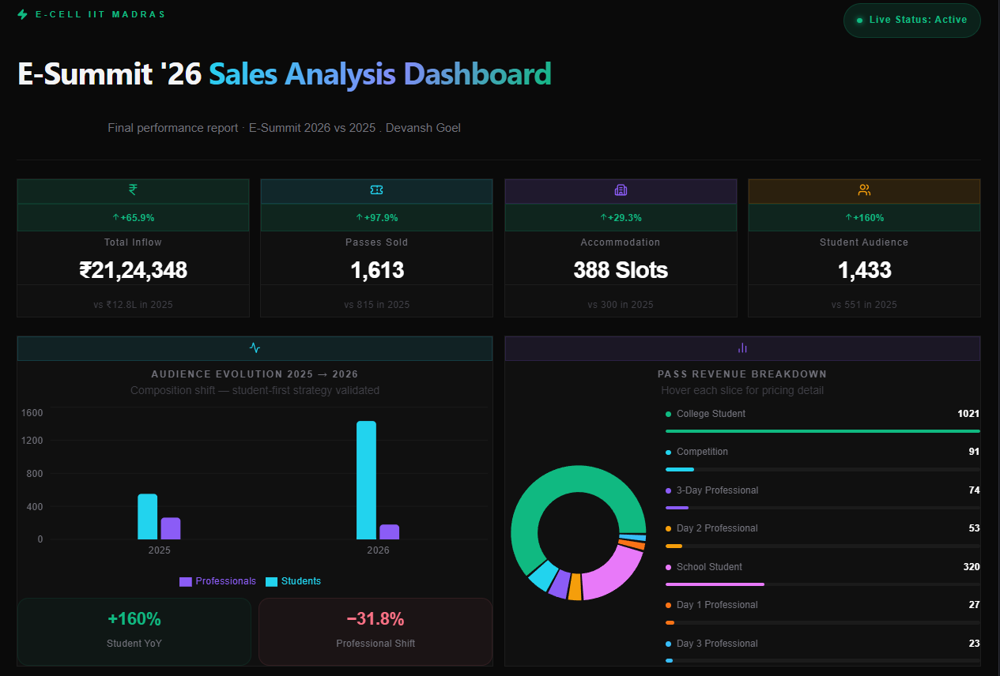

# E-Summit '26 — Sales Command Center

An interactive analytics dashboard for **E-Summit 2026 (E-Cell, IIT Madras)** that turns raw pass-sales data into a live decision tool — tracking revenue, pass-type mix, geographic reach, and the impact of outreach channels across the campaign.

**Live:** https://esummit-dashboard.vercel.app

<!-- Add a screenshot for instant context:

-->

---

## What it is

A single-page React dashboard built on top of a cohort analysis of E-Summit pass sales. The upstream analysis (cleaning, cohorting, YoY comparison) was done in **Python / Excel**; this app is the presentation layer that makes the findings explorable for the E-Cell team and sponsors.

It answers, at a glance: *where is revenue coming from, which audiences and cities are growing, and which outreach efforts actually converted?*

## Key insights surfaced

- **1,613 pass transactions** analyzed across **7 pass types**, **10 cities**, and **11 institutions**.
- A **+808% surge in school participation**, the largest driver behind **+65.9% YoY revenue growth** to **₹21.24L**.
- Revenue decomposed into **3 streams**, with **473 passes** attributed to structured outreach initiatives.
- **+97.9% growth in total passes** and **+160% growth in student attendance** year over year.
- **Chennai accounted for 34.5%** of all sales — the single largest geographic segment.

> Note: total passes grew faster (+97.9%) than revenue (+65.9%), reflecting a deliberate mix shift toward lower-priced school/student passes that widened reach.

## Features

- **8 interactive chart modules** (Recharts) covering revenue trend, pass-type breakdown, city/institution distribution, YoY growth, and outreach-channel attribution.
- **KPI summary cards** for headline metrics (total revenue, passes sold, YoY deltas).
- **Responsive layout** (Tailwind CSS) that works on desktop and mobile.
- **Static, shareable deploy** on Vercel — one link for the team, no setup.

## Tech stack

| Layer | Tool |
|---|---|
| Framework | React + Vite |
| Charts | Recharts |
| Styling | Tailwind CSS |
| Data prep | Python / Excel (upstream cohort analysis) |
| Hosting | Vercel |

## Run locally

```bash
git clone https://github.com/DevGoyal07/esummit-dashboard.git
cd esummit-dashboard
npm install
npm run dev        # start dev server (Vite)
npm run build      # production build
```

## Data note

Figures are drawn from E-Cell IIT Madras's internal E-Summit pass-sales records, aggregated for analysis. No personally identifiable attendee data is included in this repository.

---

*Built as a product-analytics + frontend project: real event data → cohort analysis → an interactive dashboard a non-technical team can actually use.*
